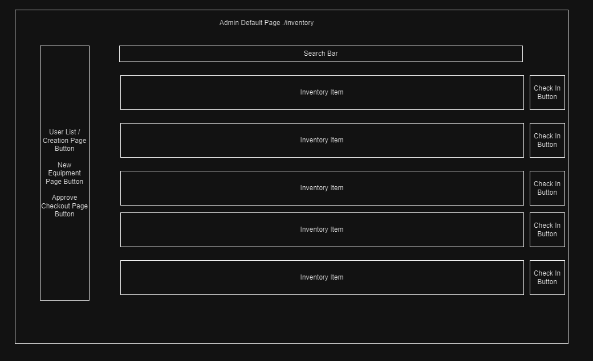
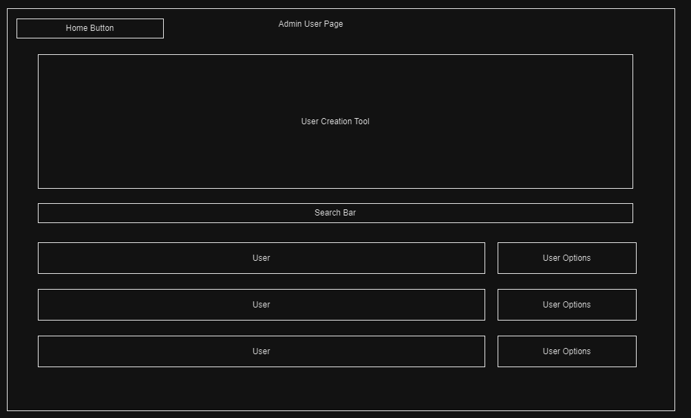
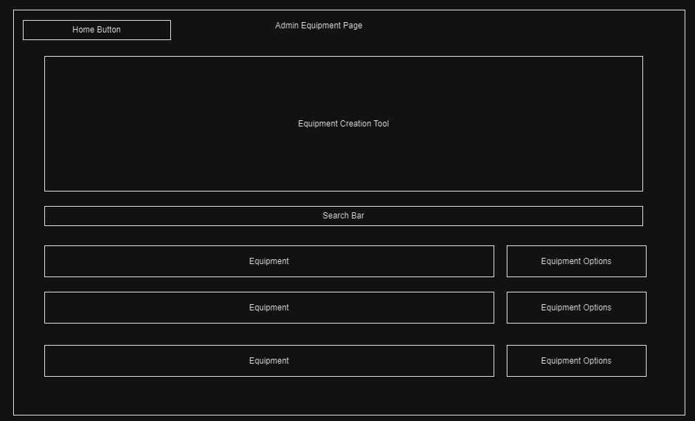
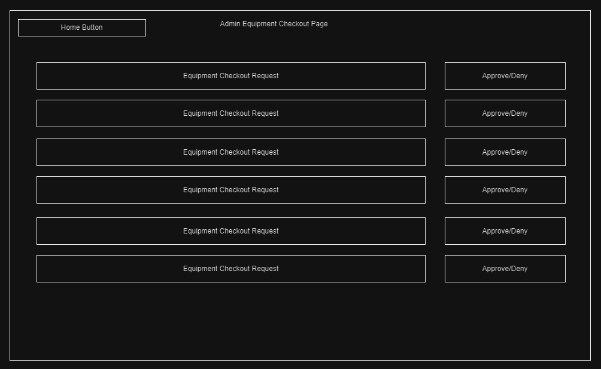
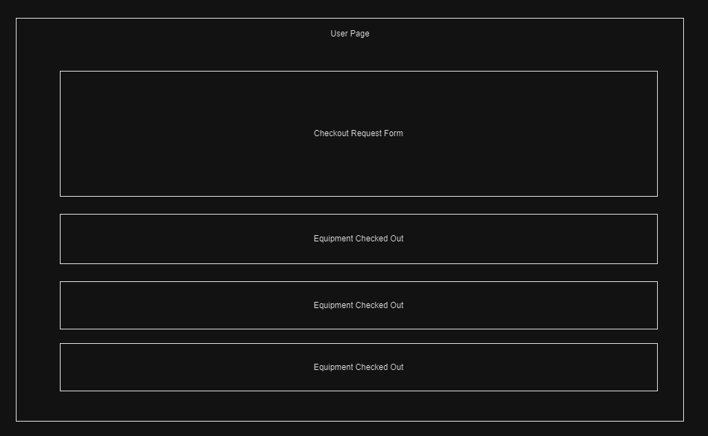
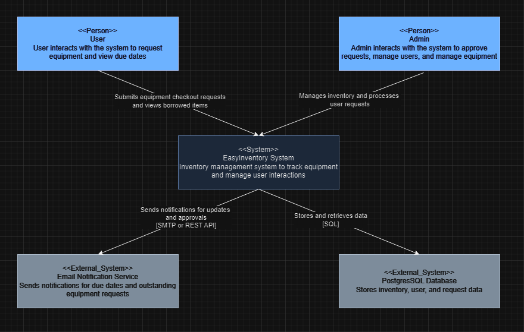
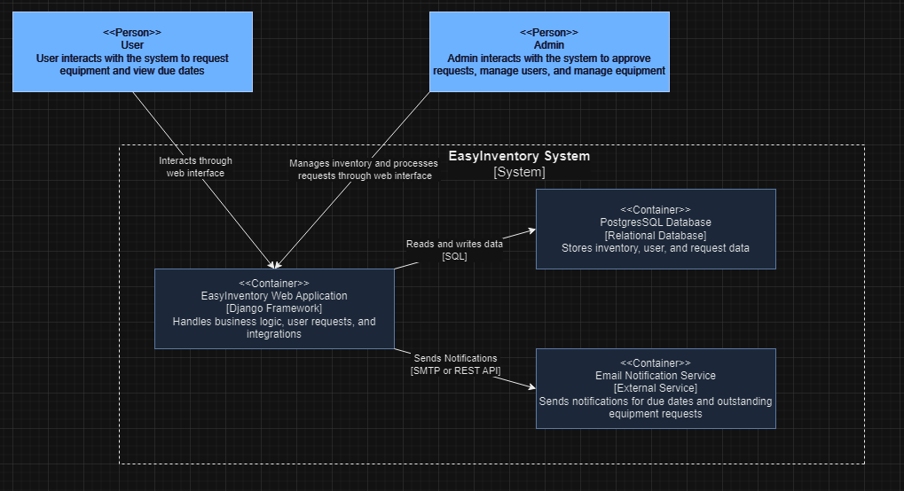
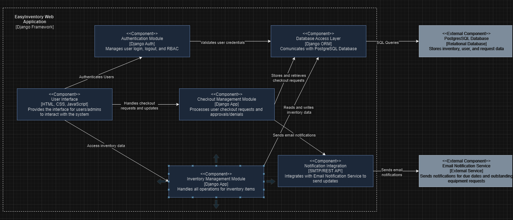

# **User Stories for EasyInventory**

## **User Stories**
Understanding the requirements of our users is critical to building an effective and efficient product. Below are the primary user stories for EasyInventory:

1. **As an administrator, I want to add and manage inventory items so I can maintain an accurate and up-to-date inventory list.**
   - **Acceptance Criteria**:
     - Admin can log in to the system and access the inventory management dashboard.
     - Admin can add, edit, and delete inventory items.

2. **As a user, I want to request equipment checkouts so I can borrow items needed for my tasks.**
   - **Acceptance Criteria**:
     - Users can log in and view available inventory.
     - Users can submit a checkout request with a use case and return date.

3. **As an administrator, I want to approve or deny checkout requests so I can ensure the proper allocation of resources.**
   - **Acceptance Criteria**:
     - Admins can view pending checkout requests and approve or deny them.
     - Approved requests update the inventory to reflect the checked-out item.

4. **As a user, I want to view my checked-out items so I can keep track of what I have borrowed.**
   - **Acceptance Criteria**:
     - Users can see a list of items they have checked out along with return dates.

---

## **Misuser Stories**

Misuser stories help identify potential ways the application might be misused and allow us to mitigate those risks.

1. **As a malicious user, I want to submit fraudulent checkout requests repeatedly to disrupt the system.**
   - **Mitigation Criteria**:
     - Implement CAPTCHA on checkout request forms.
     - Limit the number of requests a user can submit at a time.

2. **As an unauthorized user, I want to access the admin panel so I can tamper with inventory data.**
   - **Mitigation Criteria**:
     - Require authentication and role-based access control for all admin pages.
     - Log all access attempts to the admin panel for auditing.

---

## **Acceptance Criteria Summary**

- **For Admins**:
  - Access inventory management features.
  - Approve or deny user requests with proper logging.

- **For Users**:
  - Submit valid checkout requests with a clear use case.
  - View a list of items they currently have checked out.

---

## **Conclusion**
By clearly defining user stories, acceptance criteria, misuser stories, and mitigation strategies, EasyInventory ensures a robust and user-friendly experience while safeguarding against potential misuse.

# **Mockup Pages**

## **Default Admin Page**

## **Admin User Page**

## **Admin Equipment Page**

## **Admin Equipment Approve Page**

## **User Page**

# **Diagrams**

## **Context Diagram**

## **Container Diagram**

## **Component Diagram**

